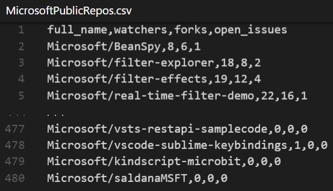
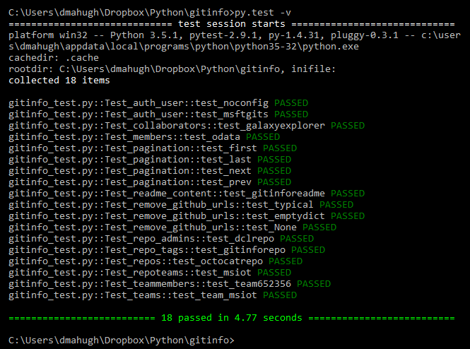

<properties LandingPageTags="Python,GitHub,REST,OSPO" />

# GitHub API helper functions

Gitinfo is a library for Python 3.x to simplify use of the GitHub REST API. It provides wrappers for common
gitHub API calls which returns Python *lists* of *namedtuple* objects, making it very easy to work with the
returned data in Python.

Gitinfo is a work in progress &mdash; pull requests, feature requests and issues welcome!

## sample usage

Here's a simple example of how to use gitinfo to write a CSV file containing a list of repos:

```python
import gitinfo as gi
ms_repos = gi.repos(org='microsoft')
gi.write_csv(ms_repos, 'MicrosoftPublicRepos.csv')
```
The generated CSV file contains one row per public repo in the Microsoft organization on GitHub:



## installation

Gitinfo has one external dependency - the [requests](https://pypi.python.org/pypi/requests) library. Follow these steps to get up and running:

* Install Python 3.5 from [Python.org](https://www.python.org/).
* Clone the [Gitinfo repo](https://github.com/dmahugh/gitinfo).
* Install requests: ```pip install requests```

## tests

The file [gitinfo_test.py](https://github.com/dmahugh/gitinfo/blob/master/gitinfo_test.py) contains
[pytest](http://pytest.org/latest/) tests for gitinfo functions. Note that some of these tests require
admin access to organizations or repos, so if you're not configured with credentials for the *msftgits* user those
tests won't pass.

Here's an example of a successful test run:



## where to learn more
For more examples of how to use gitinfo, see the [overview](documentation/overview.md).

For API syntax, see the [gitinfo documentation](documentation/gitinfo.md).

Gitinfo wraps portions of the [GitHub V3 API](https://developer.github.com/v3/).
