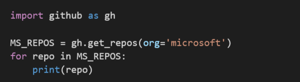

# gitinfo

Python 3.x helper functions to make it easy to retrieve information via the GitHub API.

What it is:

* Optimized for ease of use.
* A module with one external dependency - the [requests](https://pypi.python.org/pypi/requests) library.
* Work in progress; much more to come.

What it isn't:

* A complete wrapper for the GitHub API - many calls not supported (yet).
* A way to do automated updates and changes; all functions are read-only.

## sample usage

Here's an example of how to retrieve all public repos in the Microsoft organization:



And here's the output for that example:


Here's an example of how to retrieve the public repos for a specified user (Octocat) instead of organization, and how to specify fields to be returned (full_name and default_branch):


## authentication
You can use this module to retrieve public information from GitHub without any authentication, but the 60 requests per hour rate limit
will be enforced. You can bump that up to 5000 requests per hour by using authentication.

Only basic authentication via username and PAT (Personal Access Token) is supported at this time. To use it, put your GitHub username and a PAT in environment variables named *GitHubUser* and *GitHubPAT*, respectively.

## saving results
The ```get_members()``` and ```get_repos()``` functions return a list of _namedtuple_ objects. The ```write_csv()``` function can be used to write these lists to a CSV file:

```
import gitinfo as gi
ms_members = gi.get_members(org='microsoft')
gi.write_csv(ms_members, 'MicrosoftMembers.csv')
```
