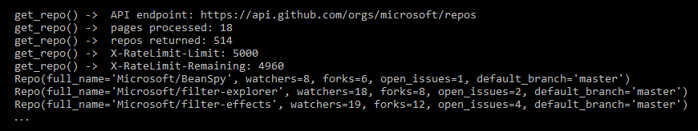
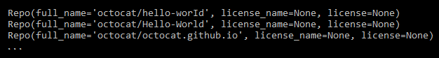
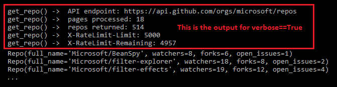

# gitinfo - Python 3.x library for GitHub REST API

This is a simple wrapper optimized for ease of use, supporting a subset of the GitHub API. (Ony repo and member info at this time.) Intended for use in automating common administrative and monitoring activities.

## installation

Gitinfo has one external dependency - the [requests](https://pypi.python.org/pypi/requests) library. Follow these steps to get up and running:

* Install Python 3.5 from [Python.org](https://www.python.org/).
* Clone the [Gitinfo repo](https://github.com/dmahugh/gitinfo).
* Install requests: ```pip install requests```

## sample usage

Here's an example of code to retrieve and display repos by *organization*:

```
import gitinfo as gi
ms_repos = gi.repos(org='microsoft')
for repo in ms_repos:
    print(repo)
```

And here's the output for that example:



Similar syntax to get repos by *user*:

```
import gitinfo as gi
oct_repos = gi.repos(user='octocat')
for repo in oct_repos:
    print(repo)
```

And here's the output for that example:



## verbose() setting
You can set "verbose mode" on to get status information displayed to the console. For example:

```
import gitinfo as gi
gi.verbose(True)
ms_repos = gi.repos(org='microsoft')
for repo in ms_repos:
    print(repo)
```

... displays this console output:



## retrieving repos by user, specifying fields
Here's an example of how to retrieve the public repos for a specified user (Octocat) instead of organization, and how to specify fields to be returned (full_name and default_branch):


Some fields, such as ```license```, return a JSON document, which is inconvenient for saving to a CSV file. You can include a specific subfield instead of the entire JSON document by using dot notation. For example:


## retrieving information for multiple orgs or users
If you want to get a list of all repos in multiple org or under multiple users, you can simply pass a list instead of a single value for the ```org=``` or ```user=``` parameter in the ```repos()``` function. For example, these sorts of syntax return what you'd expect:

```
import gitinfo as gi
repolist = gi.repos(user=['octocat', 'dmahugh'])
repolist = gi.repos(org=['Azure', 'dotnet', 'Microsoft', 'OfficeDev'])
```

Note that you can also pass a list of orgs to the ```members()``` function, to return member information for multiple organizations:

```
import gitinfo as gi
memberlist = gi.members(org=['Azure', 'dotnet', 'Microsoft', 'OfficeDev'])
```

## auditing members for 2FA
One specific use case I wanted to support is auditing the members of organizations to determine who doesn't have GitHub two-factor authentication (2FA) enabled. The ```members()``` function supports an optional ```audit2fa=``` parameter for this purpose.

You must be *authenticated as an owner of an organization* to get this information. For example, if you've configured PAT for ```admin-user``` (as described in the next section below), and that user is an owner of organzation ```org-name```, here's how you would get a list of members who don't have 2FA enabled:

```
import gitinfo as gi
gi.auth_user('admin-user')
no2fa = gi.members(org='org-name', audit2fa=True)
```

## authentication
You can use this module to retrieve public information from GitHub without any authentication, but the 60 requests per hour rate limit
will be enforced. You can bump that up to 5000 requests per hour by using authentication.

GitHub credentials (username/PAT) are stored in a ```github_users.json``` file in the ```private``` subfolder. Here's the format to use:

```
{
    "user1": "Personal Access Token for user1",
    "user2": "Personal Access Token for user2"
}
```
Then you can use the ```auth_user()``` function to set the username for subsquent operations. For example:

```
import gitingo as gi
gi.auth_user('user1')
# make GitHub API calls as user1
gi.auth_user('user2')
# make GitHub API calls as user2
gi.auth_user(None)
# make GitHub API calls without authentication
```
Only basic authentication via username and PAT (Personal Access Token) is supported at this time.

## saving results
The ```members()``` and ```repos()``` functions return a list of _namedtuple_ objects. The ```write_csv()``` function can be used to write these lists to a CSV file:

```
import gitinfo as gi
ms_members = gi.members(org='microsoft')
gi.write_csv(ms_members, 'MicrosoftMembers.csv')
```
