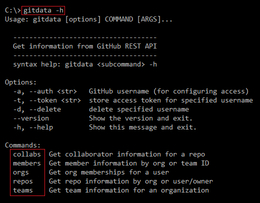

<properties LandingPageTags="Python,GitHub,REST,OSPO" />
# gitdata
A command-line tool for querying GitHub APIs to retrieve information about repos, organizations, teams, and collaborators. Provides a simple and consistent syntax for retrieving data in JSON or CSV format.

  

# Table of Contents
* [Requirements/Installation](#requirements)
* [Usage](#usage)
* [Contributing](#contributing)
* [License](#license)

# Requirements/Installation
Gitdata uses these packages:
* [Click](http://docs.python-requests.org/en/master/) version 6.6 or above
* [Requests](http://docs.python-requests.org/en/master/) version 2.9.1 or above
* [PyTest](http://pytest.org/latest/) version 2.9.1 or above

PyTest is currently only used for the *gitinfo* tests, and is not required to use gitdata.

To quickly install gitdata and begin using it:
* Clone this repo or download as a ZIP file
* In the folder containing the repo: ```pip install .```
* If you'd like to make changes to the code and immediately see them in the command-line behavior, install with ```pip install --editable .``` instead

Once you've done that, gitdata will be available at the command line. Use the -h or --help option to get syntax help.



# Usage
For detailed documentation, see the gitdata project page: [http://dmahugh.github.io/gitdata/](http://dmahugh.github.io/gitdata/)

Simple usage example &mdash; list repos for the *octocat* user:
```
c:\> gitdata repos --user=octocat --source=API
git-consortium,octocat
hello-worId,octocat
Hello-World,octocat
octocat.github.io,octocat
Spoon-Knife,octocat
test-repo1,octocat
c:\>
```
All JSON data returned by the GitHub API is cached locally, enabling fast offline queries. Here's a query that returns the license name for the same repos listed above, from the local cached data, using optional abbreviated syntax, and writes it to a license.csv file:
```
c:\> gitdata repos -uoctocat -scache -fname/license.name -nlicense.csv
git-consortium,MIT License
hello-worId,None
Hello-World,None
octocat.github.io,None
Spoon-Knife,None
test-repo1,None
Output file written: license.csv
```

# Contributing
Gitinfo is a work in progress &mdash; pull requests, feature requests and issues welcome.

I've implemented functionality as I need it for various projects, but I'm interested in knowing what other types of functionality
may be useful to others. Please log an [issue](https://github.com/dmahugh/gitdata/issues) if you have a suggestion. Thanks!

# License
Gitdata is licensed under the [MIT License](https://github.com/dmahugh/gitdata/blob/master/LICENSE).

Copyright &copy; 2016 by Doug Mahugh

