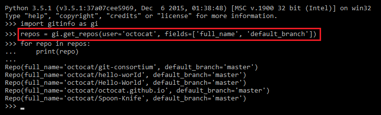
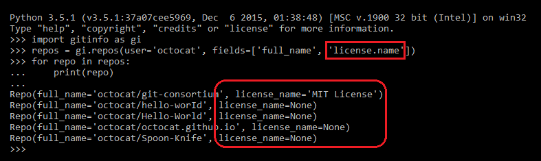
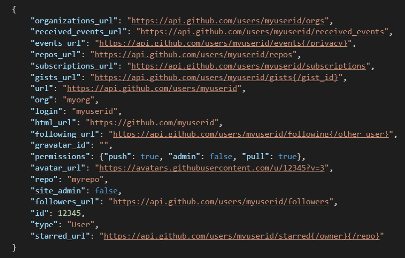
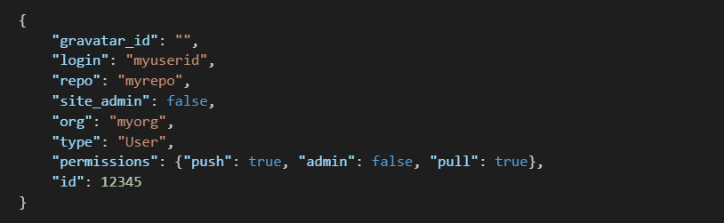
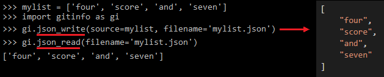

# gitinfo - overview

Gitinfo is a set of wrapper functions for GitHub API calls that return information about organizations, repos, users, and the relationships between these entities. API pagination is handled automatically &mdash; Gitinfo functions return complete data sets. All functions return native Python data structures (*lists* of *namedtuple* objects).

This page provides a summary of how to use gitinfo. There is also detailed information in the docstrings in the [source code](https://github.com/dmahugh/gitinfo/blob/master/gitinfo.py) and in the auto-generated [documentation](gitinfo.md).

For API syntax, see the [gitinfo documentation](documentation/gitinfo.md).

Gitinfo wraps portions of the [GitHub V3 API](https://developer.github.com/v3/).

## Table of Contents

* [installation](#installation)
* [basic concepts](#basic-concepts)
* [examples](#examples)
* [authentication](#authentication)
* [specifying fields](#specifying-fields)
* [auditing 2FA configuration](#auditing-2fa-configuration)
* [logging output](#logging-output)
* [minimizing GitHub API responses](#minimizing-github-api-responses)
* [saving data](#saving-data)
* [tests](#tests)

## installation

Gitinfo has one external dependency - the [requests](https://pypi.python.org/pypi/requests) library. Follow these steps to get up and running:

* Install Python 3.5 from [Python.org](https://www.python.org/).
* Install requests: ```pip install requests```
* Clone the [Gitinfo repo](https://github.com/dmahugh/gitinfo).

## basic concepts

The core functions (```members()```, ```repos()```, ```teams()```, ```repoteams()```, ```collaborators()```) each return a list of namedtuple objects, and these namedtuples may contain a set of default fields or you can specify the fields to be returned. You can specify one or more orgs, repos or teams and you get back a single consolidated list appropriate for reporting/auditing scenarios.

The GitHub API requires authentication to access certain information, and to allow for more than 60 API calls per hour. You can store authentication credentials (username/PAT) in a JSON file as described below, then use ```auth_config()``` specify the username for subsequent API calls.  

By default, gitinfo displays status information on the console. You can turn this on or off, or direct this information to a log file, through settings managed by ```log_config()```. The ```session_start()``` and ```session_end()``` functions can be used to identify a gitinfo session for the purpose of tracking number of API calls, bytes returned, and elapsed time. You can use the ```log_msg()``` function to add your own information to the logs as well.

## examples

For these examples, we'll assume you've imported ```gitinfo``` as ```gi```:

```
import gitinfo as gi
```

There are currently four main functions that provide most of the functionality, and the following are simple examples of how to use each of them.

### repos()
The examples below return public repos only. To return private repos, you need to be authenticated as a member of the repo's organization or the repo's owner.
```python
# get all public repos for an organization
ms_repos = gi.repos(org='microsoft')

# get all public repos for a set of organizations
azure_repos = gi.repos(org=['Azure', 'Azure-Readiness', 'Azure-Samples', 'AzureAD', 'AzureADSamples'])

# get all repos for a user
octocat_repos = gi.repos(user='octocat')

# get all repos for a set of users
misc_repos = gi.repos(['kennethreitz', 'codelucas'])
```
### members()
Public members can be returned without authentication, but you need to be authenticated as a member of an organization to see concealed members.
```python
gi.auth_config({'username': 'your-user-name'})

# get members of an organization
org_members = gi.members(org='your-org-name')

# get members of multiple organizations
org_members = gi.members(org=['org1', 'org2', 'org3']

# for team members, use the ID instead of the name
team_members = gi.members(team='123456')

# get members of multiple teams
team_members = gi.members(team=['111111', '222222', '333333'])
```
### teams()
To retrieve team information, you must be authenticated as a member of the Owners for the organization being managed.
```python
gi.auth_config({'username': 'your-user-name'})

# get teams for one organization
teams = gi.teams(org='org-name')

# get teams for a set of organizations
teams = gi.teams(org=['org1', 'org2', 'org3'])
```

### repoteams()
This function returns information about teams associated with specific repos in an organization.
```python
gi.auth_config({'username': 'your-user-name'})

# Note that the org parameter is required in all cases

# get team information for a single repo
teams = gi.repoteams(org='org-name', repo='repo-name')

# get team information for a set of repos
teams = gi.repoteams(org='org-name', repo=['repo1', 'repo2', 'repo3'])

# special case: omit repo parameter for ALL repos in an organization
teams = repoteams(org='org-name')
```

### collaborators()
This function returns information about collaborators associated with specific repos.
```python
gi.auth_config({'username': 'your-user-name'})

# Note that the owner and repo parameters are both required

# get collaborator information for a single repo
teams = gi.collaborators(owner='org-name', repo='repo-name')

# get collaborator information for a set of repos
teams = gi.collaborators(org='org-name', repo=['repo1', 'repo2', 'repo3'])
```

## authentication
You can use gitinfo to retrieve public information from GitHub without any authentication, but the 60 requests per hour rate limit
will be enforced, and you won't have access to certain information as mentioned above. You can bump the API rate limit up to 5000 requests per hour by using authentication.

GitHub credentials (username/PAT) are stored in a ```github_users.json``` file in the ```private``` subfolder. Here's the format to use:

```python
{
    "user1": "Personal Access Token for user1",
    "user2": "Personal Access Token for user2"
}
```
Then you can use the ```auth_config()``` function to set the username for subsquent operations. For example:

Note that there is a ```ratelimit_status()``` function for checking the current status of a user's rate limit. This can be useful for checking whether sufficient API calls are available for a task.

```python
import gitingo as gi
gi.auth_config({'username': 'user1'})
# make GitHub API calls as user1
gi.auth_config({'username': 'user2'})
# make GitHub API calls as user2
gi.auth_config('username': None)
# make GitHub API calls without authentication
```
Only basic authentication via username and PAT (Personal Access Token) is supported at this time.

## specifying fields
Gitinfo functions return a list of namedtuples which contain either a default set of fields or a set of fields that you can specify. Here are the default fields for each of the major functions:

* repos() - org, user, full_name, watchers, forks, open_issues
* members() - org, login, id, type, site_admin
* teams() - org, name, id, privacy, permission
* repoteams() - org, repo, name, id, privacy, permission
* collaborators() - owner, repo, id, login, type, permissions.admin

Here's an example of how to specify fields to be returned:



Some fields, such as ```license```, return a JSON document, which is inconvenient for saving to a CSV file. You can include a specific subfield instead of the entire JSON document by using dot notation. For example:



Note that the field name ```license.name``` was transformed to ```license_name``` in the returned tuples above, because you can't have periods embedded in namedtuple identifiers.

## auditing 2FA configuration
The GitHub API supports a filter that can be used to audit the members of organizations to determine who doesn't have GitHub two-factor authentication (2FA) enabled. The ```members()``` function supports an optional ```audit2fa=``` parameter to take advantage of this filter.

You must be *authenticated as an owner of an organization* to get this information. For example, if you've configured PAT for ```admin-user```, and that user is an owner of organzation ```org-name```, here's how you would get a list of members who don't have 2FA enabled:

```python
import gitinfo as gi
gi.auth_user('admin-user')
no2fa = gi.members(org='org-name', audit2fa=True)
```

## logging output
By default, all functions in gitinfo run in "verbose mode" and display various status information on the console. You can switch verbose mode on or off via the ```log_config()``` function, and you can also send verbose output to a disk file. Console and file output are controlled independently, by the ```verbose``` and ```logfile``` parameters:

```python
import gitinfo as gi
gi.log_config(verbose=False, logfile='gitinfo.log') # send status info to a logfile, but don't display it
```

There are also ```session_start()``` and ```session_end()``` functions that you can put before and after a block of code to get a summary of how many API calls were made, how many bytes returned, API rate-limit status, elapsed time, etc. Here's an example of typical output to a log file using all of these options:


Note that Personal Access Tokens are not displayed or written to log files - just the first 2 and last 2 characters, to help identify which PAT was used.

## minimizing GitHub API responses
The JSON payload returned by GitHub API calls may contain many URLs for each entity. These are endpoints for getting other data related to the entity, and they're handy if you're implementing a user interface, but not needed for common data analysis and reporting tasks. If you're capturing large numbers of GitHub API responses for reporting purposes, the presence of all of those long URL strings can significantly bloat your data &mdash; in one instance, for example, I found that a 360MB stream of GitHub API responses (from the ```collaborators``` endpoint) contained over 300MB of URLs.

Two functions are provided in gitinfo for minimizing these bloated responses:

* ```remve_github_urls()``` takes a dictionary object as input, which represents an entity returned by a GitHub API call, and returns a slimmed-down version with all of the *_url entries removed.
* ```minimize_json()``` takes a disk file as input (containing the JSON serialization of a list of entity dictionaries) and writes a slimmed-down version to a specified output file.

Here's an example of a typical GitHub API response before minimizing:



And here's the same response after minimizing with remove_github_urls():



Minimizing cached data in this manner can signficantly improve the performance of reporting and analytics processes running against the data.

A note for Python fans: the ```remove_github_urls()``` functions uses a *dictionary comprehension* to remove the URLs, which makes it a one-liner. Here's the code:

```python
def remove_github_urls(dict_in):
    return {key: dict_in[key] for key in dict_in if not key.endswith('_url') and not key == 'url'}
```

## saving data
Gitinfo query functions return a list of namedtuple objects, and the ```write_csv()``` function can be used to write these lists to a CSV file:

```python
import gitinfo as gi
ms_members = gi.members(org='microsoft')
gi.write_csv(ms_members, 'MicrosoftMembers.csv')
```

There are also ```json_write()``` and ```json_read()``` functions that can be used to save GitHub API payloads to disk and read them back:



## tests

The file [gitinfo_test.py](https://github.com/dmahugh/gitinfo/blob/master/gitinfo_test.py) contains
[pytest](http://pytest.org/latest/) tests for gitinfo functions. Note that some of these tests require
admin access to organizations or repos, so if you're not configured with credentials for the *msftgits* user those
tests won't pass.

Here's an example of a successful test run:


